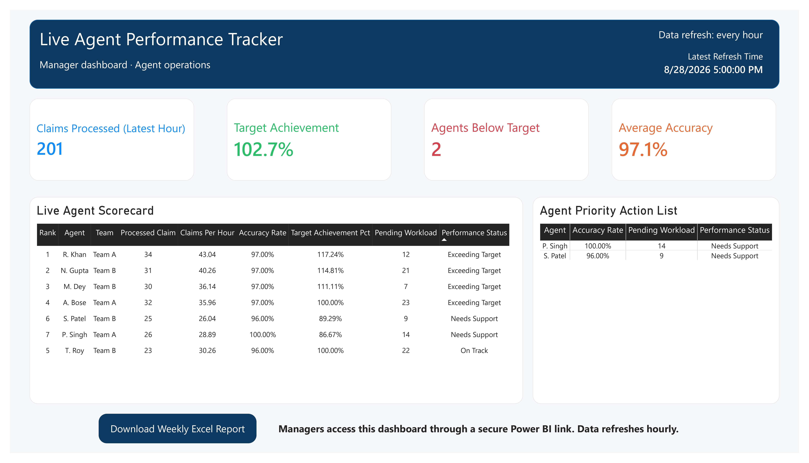

# Automated Healthcare RCM Live Tracker

An end-to-end Healthcare Revenue Cycle Management (RCM) analytics project built with MySQL, Python automation, Windows Task Scheduler, and Power BI.

## Project Overview

This project simulates a real healthcare RCM operations environment where claim and agent performance data updates automatically every hour.

## Dashboard Pages

### 1. Live Agent Performance Tracker

- Claims processed in the latest hour
- Target achievement and average accuracy
- Agents below target
- Agent scorecard and priority action list

### 2. RCM Live Tracker

- Total claims and collections
- Denial rate
- High-priority claims
- Live claim-status breakdown
- Priority claim action list

## Automation Pipeline

```text
Windows Task Scheduler (every hour)
        ↓
Python pipeline generates new RCM activity
        ↓
MySQL database is updated
        ↓
Power BI dashboards refresh with current KPIs

## Technology Stack

- MySQL
- Python
- MySQL Connector/Python
- Windows Task Scheduler
- Power BI Desktop
- DAX
- SQL
- Power Query

## Database Objects

- `agent_dim`
- `agent_hourly`
- `claim_fact`
- `refresh_log`
- `vw_live_agent_performance`
- `vw_rcm_live_kpis`

## Business Impact

- Eliminates manual hourly data uploads
- Tracks agent productivity and accuracy
- Highlights agents requiring support
- Monitors claim status, denial rate, collections, and priority claims
- Supports faster operational decisions for healthcare RCM managers

## Dashboard Screenshots

### Live Agent Performance Tracker



### RCM Live Tracker


## Security Note

Database credentials are stored locally in a `.env` file and are not included in this repository.
